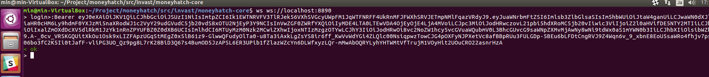
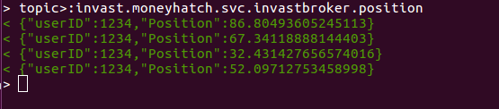

# DongFeng-Websocket

Websocket server provides a channel to passthru nats subscriber to front-end. Supports login by JWT ID token and json message formats.

## Dependencies

- [ilovelili/websocket-nats](https://github.com/ilovelili/websocket-nats) WebSocket gateway for [nats.io](http://nats.io/)

## Authentication

An explicit login request must be sent to websocket server to initialize connection.
format: `login>:Bearer <JWT ID token>`

## Subscribe topic

An explict topic must be submitted to websocket server to set up subscription.
format: `topic>:<topic>`

## Contact

<route666@live.cn>